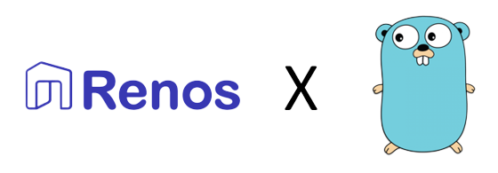

# Renos Go Repository Template

<div align="center">

</div>

## Project Architecture

```bash
├── cmd
│   ├── command
│   │   └── command.go
│   ├── migrate_down.go
│   ├── migrate_make.go
│   ├── migrate_up.go
│   ├── migrate.go
│   └── root.go
├── database
│   ├── migrations
│   └── postgres.go
├── domain
│   ├── <module_name>.go
│   └── README.md
├── infrastructure
│   ├── zapslack
│   │   └── slack.go
│   ├── env.go
│   ├── file_rotator.go
│   ├── grpc.go
│   ├── httpserver.go
│   ├── logger.go
│   └── resty.go
├── lib
│   ├── README.md
│   └── response.go
├── <module_name>/
│    ├─ delivery/
│    │  ├─ http/
│    │  │  ├─ *.go
│    │  ├─ grpc/
│    │  │  ├─ *.go
│    │  │  ├─ proto/
│    │  │  │  ├─ *.proto
│    │  │  │  ├─ *.pb.go (generated by protoc)
│    │  │  │  ├─ *_grpc.pb.go (generated by protoc)
│    ├─ usecases/
│    │  ├─ *.go
│    ├─ entities/
│    │  ├─ *.go
│    ├─ repositories/
│    │  ├─ <database_driver>/
│    │  │  ├─ *.go
│    │  ├─ <service_name>/
│    │  │  ├─ *.go
│    │  ├─ <3rd_party_name>/
│    │  │  ├─ *.go
├── .env.example
├── .gitignore
├── Dockerfile
├── go.mod
├── go.sum
├── logo.png
├── main.go
├── Makefile
├── README.md
└── test.md
```

Source: [Golang Clean Architecture Example Repo](https://github.com/bxcodec/go-clean-arch)

## Requirements

- Postgres
- Air (Hot Reload) (<https://github.com/cosmtrek/air>)
- Go (<https://go.dev/dl/>)
- Docker
- Git
- run makefile (for windows) (<https://gist.github.com/evanwill/0207876c3243bbb6863e65ec5dc3f058#make>)

## How to use this template

1. Click `use this template` button
2. Replace all occurences of `go-starter-template` to `repo_name` in all files  
3. Copy .env.example to .env and configure it.
4. Edit README.md and remove this section.

## Run Locally

Clone the project

```bash
  git clone https://github.com/Renos-id/payment-gateway-service.git
```

Go to the project directory

```bash
  cd my-project
```

Copy example env and configure the env

```bash
    cp .env.example .env
```

Install dependencies

```bash
  go mod download
```

Run migrations

```bash
    make migrate up
```

or

```bash
    go run cmd/command/command.go migrate up
```

Start the server

```bash
  make run
```

or

```bash
  go run main.go
```

## Makefile commands

Run Go Project

```bash
    make run
```

Build Go Project

```bash
    make build
```

Run all of outstanding migrations

```bash
    make migrate-up
```

Roll back to the latest migration operation

```bash
    make migrate-down
```

Create New Migration File

```bash
    make migration-new filename=create_example_table
```

Create New Domain

```bash
    make module-new name=module_name
```

## Dependencies / Libraries

- Chi (<https://github.com/go-chi/chi>)
- Sqlx (<https://github.com/jmoiron/sqlx>)
- GoDotEnv (<https://github.com/joho/godotenv>)
- Resty (<https://github.com/go-resty/resty>)
- Cobra (<https://github.com/spf13/cobra>)
- Go-Migrate (<https://github.com/golang-migrate/migrate>)
